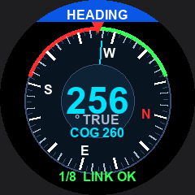
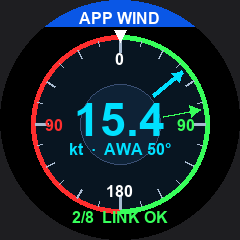
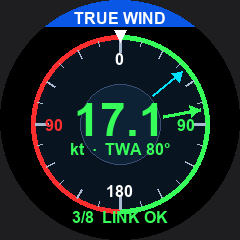
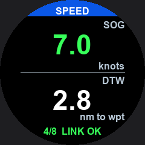
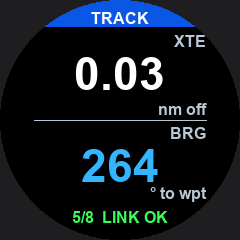
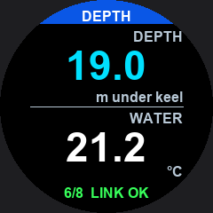
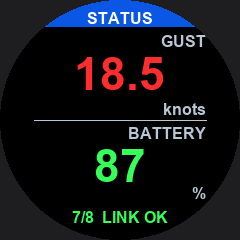
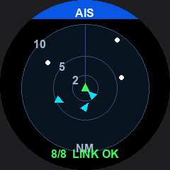
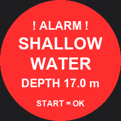

# Marine Console for Garmin quatix 5 + ESP32 link

A marine instrument console for the Garmin **quatix 5** (a Connect IQ watch app)
fed by an **ESP32 companion** that bridges the boat's data to the watch.

The quatix 5 (fēnix 5 generation, Connect IQ System 3) has **no generic BLE**
(`Toybox.BluetoothLowEnergy` is unavailable), so a watch app cannot talk to an
ESP32 as a BLE central. The workaround: the ESP32 impersonates a **native BLE
heart-rate sensor**, the watch pairs it like any HR strap, and the app reads the
"heart rate" via `Toybox.Sensor`. The firmware multiplexes the whole marine
dataset over that one number using a tag/value protocol; the app decodes it.

The ESP32 reads real boat data from **NMEA 0183** (UART), **NMEA 2000** (CAN) or
**NMEA 0183 over WiFi**, and also has a built-in **demo** source for testing
without a boat.

## Watch variants

| Variant | Watch | Link | Notes |
|---|---|---|---|
| **quatix 5** (`garmin_marine_console_q5_v5/`) | quatix 5 (no generic BLE) | impersonated HR sensor, ~1 byte/s, one-way | the original |
| **Venu 3** (`garmin_marine_console_venu3/`) | Venu 3 / 3S (generic BLE) | custom GATT service, full frame, **bidirectional** (MOB) | responsive 454px touch UI — see **[README_VENU3.md](README_VENU3.md)** |
| **Beacon** (`garmin_marine_beacon/`) | **any generic-BLE Garmin, 2019+** | **connectionless** broadcast in the advertising payload, read by scanning | one binary, 90 products (fēnix/epix/Venu/FR/Edge…), one-way — see **[README_BEACON.md](README_BEACON.md)** |
| **Hybrid** (`garmin_marine_hybrid/`) | **any generic-BLE Garmin, 2019+** | beacon telemetry **+ a brief connection only for MOB** | universal **and** bidirectional — see **[README_HYBRID.md](README_HYBRID.md)** |

All are fed by the same `esp32_nauticsense_link/` firmware; `CFG_LINK_MODE` in
`config.h` picks the transport (`CFG_LINK_HR` / `CFG_LINK_NATIVE` / `CFG_LINK_BEACON`
/ `CFG_LINK_HYBRID`).

## Demo screens

| Heading (compass) | Apparent wind | True wind |
|:---:|:---:|:---:|
|  |  |  |
| **Speed** | **Track** | **Depth** |
|  |  |  |
| **Status** | **AIS** | **Shallow alarm** |
|  |  |  |

Contact sheet: [`screens/_contact_sheet.png`](screens/_contact_sheet.png).
These are faithful 240×240 round-masked mockups rendered by
[`screens/render_screens.py`](screens/render_screens.py) (Python + Pillow:
`python3 screens/render_screens.py`).

## Repository layout

- **`garmin_marine_console_q5_v5/`** — the Connect IQ watch app (Monkey C).
  Clean `DataModel` / `DataSource` architecture; `LiveDataSource` reads the
  HR channel. See [its notes](#watch-app).
- **`esp32_nauticsense_link/`** — the **maintained ESP32 firmware** (Arduino IDE
  sketch, modular). Reads NMEA 0183 / 2000 / WiFi, falls back to demo, and feeds
  the watch over the HR link. See its
  [README](esp32_nauticsense_link/README.md).
- **`esp32_ble_hr_sensor_for_garmin/`** — legacy single-file version of the same
  link (same wire protocol), kept as a minimal reference. See its
  [README](esp32_ble_hr_sensor_for_garmin/README.md).
- **`screens/`** — demo screen mockups + the Pillow renderer.
- **`hardware/`** — wiring schematic (KiCad-style SVG/PNG + `.kicad_sch`) for the
  ESP32 with the SN65HVD230 CAN board (NMEA 2000) and a MAX490 RS-422 module
  (NMEA 0183), plus netlist + BOM. See [hardware/README.md](hardware/README.md).

## Watch app

8 pages, swiped with Next/Previous:

| # | Page | Shows |
|---|------|-------|
| 0 | HEADING   | OCEAN-style compass: HDG true, COG needle, port/stbd arc |
| 1 | APP WIND  | wind dial, apparent-wind needle + AWS |
| 2 | TRUE WIND | wind dial, true-wind needle + TWS |
| 3 | SPEED     | SOG + distance-to-waypoint |
| 4 | TRACK     | cross-track error + bearing-to-waypoint |
| 5 | DEPTH     | depth under keel + water temperature |
| 6 | STATUS    | gust + battery + link state |
| 7 | AIS       | range rings (2/5/10 nm), targets as dots/triangles |

- **Buttons:** Next/Previous Page swipe pages; **START** dismisses an alarm or
  reconnects the sensor; **MENU** toggles a sun/inverted contrast mode.
- **Backlight** stays on 30 s after interaction.
- **Alarms** (e.g. shallow water) take over the screen as a full overlay with a
  single vibration, dismissed by START.
- A field is shown only when valid; otherwise it reads `---`. The footer shows
  **LINK OK** / **NO LINK**.

### Build (Connect IQ)

Requires the Connect IQ SDK + **JDK 17** (`brew install openjdk@17`) and a
developer key.

```bash
cd garmin_marine_console_q5_v5
./build.sh fenix5     # validation (fenix5 covers the quatix 5 part number)
./build.sh            # production (quatix5) — once that device is installed
```

Install by USB sideload: copy `bin/MarineConsoleQ5V5.prg` to `GARMIN/APPS/` on
the watch, eject, and restart the watch.

## ESP32 link

See **[`esp32_nauticsense_link/README.md`](esp32_nauticsense_link/README.md)**
for the full build/flash, wiring, interactive terminal menu, WiFi commands and
the tag/value protocol. In short:

- Edit `config.h` for pins, bauds and boot defaults.
- Build in the Arduino IDE with **NimBLE-Arduino 2.x** (NMEA2000 libs only if
  you enable `USE_NMEA2000`).
- Serial monitor @115200 gives an interactive English configuration menu
  (DEMO/REAL, enable/disable each interface, WiFi setup).
- Pair **ESP32-NauticSense** on the watch as a sensor, then open the app.

## Status & limitations

- The watch app builds and runs; the end-to-end link works with demo data.
- The HR channel is **one byte/second** — fine for slowly-changing instruments,
  heading is prioritised in the schedule (~8 s refresh), secondary fields rotate
  (~1–2 min). It is **one-way** (watch can only read); the quatix 5 cannot send
  data back over this channel.
- For high-rate or bidirectional links you would need a phone bridge or a newer
  watch (quatix 6/7/8 with generic BLE).

## License

MIT — see [`LICENSE`](LICENSE).
