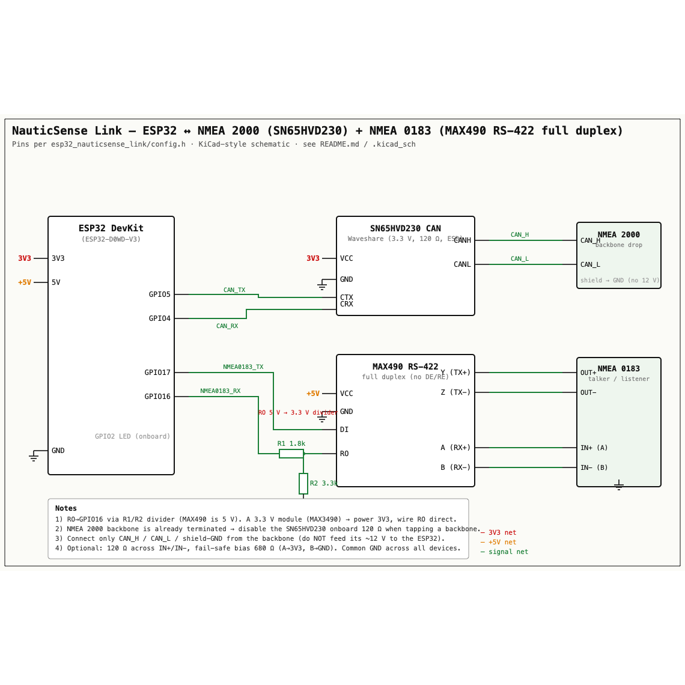

# NauticSense Link — wiring / schematic

Hardware for the `esp32_nauticsense_link/` firmware: an **ESP32 DevKit** reading
the boat's data and bridging it to the Garmin watch over BLE.

- **NMEA 2000 (CAN)** via a **Waveshare SN65HVD230 CAN board** (3.3 V CAN
  transceiver with onboard 120 Ω termination + ESD protection).
- **NMEA 0183** via a **MAX490 RS-422 module** — full-duplex, so it converts
  both directions between the ESP32's TTL UART and the differential RS-422 bus
  (no direction-control pin; the MAX490 driver and receiver are always on).



Schematic: **[`nauticsense_link.svg`](nauticsense_link.svg)** (vector) ·
**[`nauticsense_link.png`](nauticsense_link.png)** (above) · editable
**[`nauticsense_link.kicad_sch`](nauticsense_link.kicad_sch)** (KiCad 7/8 — parts
placed; wire per the table below and run ERC).

```
                    +-------------------+      CTX/CRX     +------------------------+   CAN_H/L
                    |                   |<---------------->| Waveshare SN65HVD230   |<==========>  NMEA 2000
                    |    ESP32 DevKit   |   3V3 / GND      | (3.3 V CAN board)      |   backbone (drop cable)
   BLE  <-- HR/GATT |   (ESP32-D0WD-V3) |                  +------------------------+
   to Garmin watch  |                   |   TX2/RX2        +------------------------+   A/B  (Y/Z)
                    |                   |<---------------->| MAX490 RS-422 module   |<==========>  NMEA 0183
                    +-------------------+   5V / GND       | (full duplex TTL<->422)|   talker (+ optional out)
                                            (+ RO divider) +------------------------+
```

## Pin map (matches `esp32_nauticsense_link/config.h`)

### ESP32 ↔ SN65HVD230 CAN board (NMEA 2000)

| ESP32 pin | → | SN65HVD230 board | Signal |
|---|---|---|---|
| `3V3` | → | `VCC` (3V3) | 3.3 V supply |
| `GND` | → | `GND` | ground |
| `GPIO5` (`CFG_CAN_TX_PIN`) | → | `CTX` / `D` | CAN TX (MCU→bus) |
| `GPIO4` (`CFG_CAN_RX_PIN`) | ← | `CRX` / `R` | CAN RX (bus→MCU) |
| — | | `CANH` | → NMEA 2000 `CAN_H` (net white) |
| — | | `CANL` | → NMEA 2000 `CAN_L` (net blue) |

### ESP32 ↔ MAX490 module (NMEA 0183)

| ESP32 pin | → | MAX490 module | Signal |
|---|---|---|---|
| `5V` | → | `VCC` | 5 V supply *(see level note)* |
| `GND` | → | `GND` | ground |
| `GPIO17` (`CFG_N0183_TX_PIN`) | → | `DI` | TTL TX → driver in |
| `GPIO16` (`CFG_N0183_RX_PIN`) | ← | `RO` **via divider** | receiver out → TTL RX |
| — | | `A` (RX+) / `B` (RX−) | ← NMEA 0183 talker pair (listen) |
| — | | `Y` (TX+) / `Z` (TX−) | → NMEA 0183 listener pair (optional out) |

Baud: 4800 (`CFG_N0183_BAUD`; 38400 for AIS).

## ⚠️ Critical notes

1. **Level-shift `RO` → `GPIO16` (RX).** A true MAX490 runs at **5 V**, so its
   `RO` high level (~3.5–4.5 V) exceeds the ESP32's 3.3 V GPIO limit. Use a
   resistor divider on that one line: `RO —[R1 1.8 kΩ]—•— GPIO16`, `• —[R2 3.3 kΩ]— GND`
   (≈ 0.65 ratio → ~3.0 V). `DI` needs **no** shifter (3.3 V from the ESP32
   reliably drives the MAX490 input).
   *Alternative:* if your module is actually a **3.3 V variant (MAX3490)**, power
   it from `3V3` and wire `RO → GPIO16` **directly** (skip the divider).

2. **CAN termination.** The Waveshare SN65HVD230 board carries a **120 Ω**
   terminator. An NMEA 2000 backbone is **already terminated at both ends**, so
   when tapping a backbone via a drop cable **remove/disable the board's 120 Ω**
   to avoid over-termination. Keep it only if this ESP32 sits at a physical end
   of a standalone 2-node bus.

3. **NMEA 2000 power.** The backbone carries ~12 V (NET-S/NET-C). Do **not** feed
   it to the ESP32. Connect only `CAN_H`, `CAN_L`, and the shield/`GND` (common
   reference) to the SN65HVD230 bus side.

4. **NMEA 0183 polarity.** Talker `A/+` → module `A` (RX+); talker `B/−` →
   module `B` (RX−). Tie the talker's signal ground to `GND`. For RS-422 levels
   (differential), this is direct; for a TTL/3.3 V "0183" talker on the bench
   you can instead feed it straight into `GPIO16` (no MAX490 needed).

5. **Optional RS-422 fail-safe bias** (idle-state defined when no talker drives
   the line): `A —[680 Ω]— 3V3` and `B —[680 Ω]— GND`, plus the 120 Ω across
   `A–B` if this is the only/last listener on that pair.

6. **Common ground.** ESP32 `GND`, both modules' `GND`, and the bus grounds must
   be tied together.

## Bill of materials

| Ref | Part | Notes |
|---|---|---|
| U1 | ESP32 DevKit (ESP32-D0WD-V3) | ESP32 Dev Module; USB power |
| U2 | Waveshare SN65HVD230 CAN board | 3.3 V CAN, ESD-protected, 120 Ω jumper |
| U3 | MAX490 RS-422 module | full duplex (no DE/RE); 5 V (or MAX3490 @ 3.3 V) |
| R1 | 1.8 kΩ | RO→RX divider (top) |
| R2 | 3.3 kΩ | RO→RX divider (bottom, to GND) |
| R3 | 120 Ω | NMEA 0183 RX termination (optional) |
| R4, R5 | 680 Ω | RS-422 fail-safe bias (optional) |
| J1 | NMEA 2000 drop (M12 5-pin) | CAN_H, CAN_L, shield |
| J2 | NMEA 0183 terminal | talker A/B (+ optional out Y/Z), GND |

> Generated for the NauticSense Link project. The SVG is hand-drawn KiCad-style;
> the `.kicad_sch` opens in KiCad 7/8 for editing/PCB work (run ERC after wiring,
> as net labels may need nudging).
